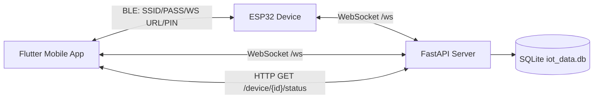
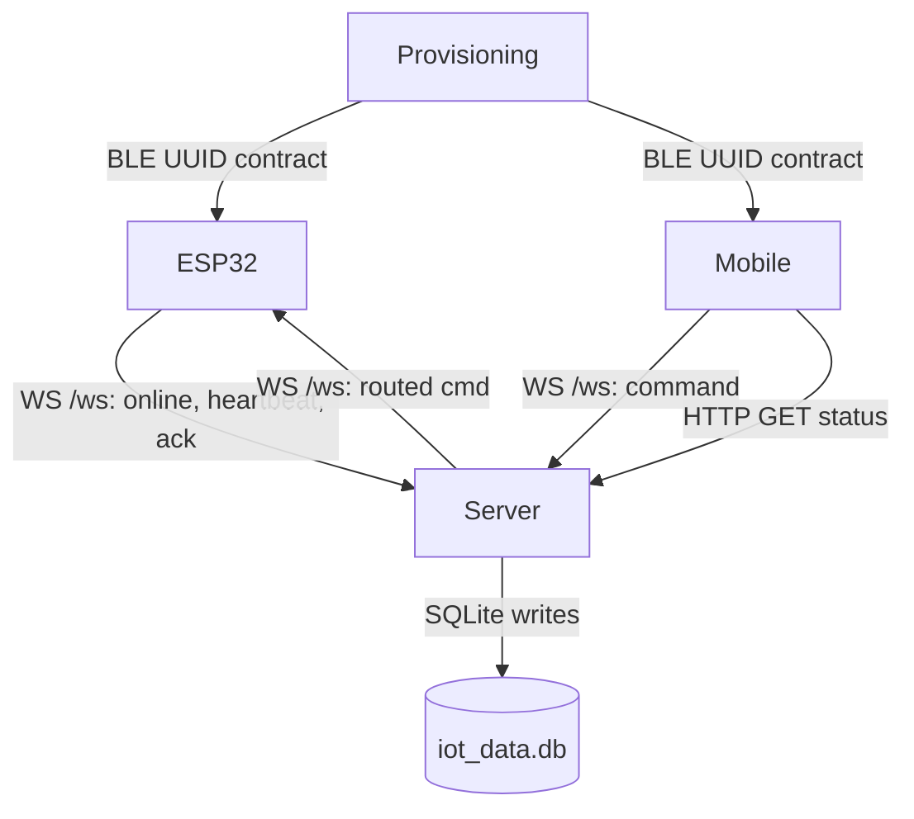

# Code Wiki

## Overview

This repository implements an end-to-end IoT “smart extension” system with three cooperating components:

- **ESP32 firmware**: BLE provisioning (WiFi + server URL + PIN) and a persistent WebSocket client that executes device commands.
- **Backend server (FastAPI)**: WebSocket hub + REST API + SQLite persistence for heartbeats and last-known device state.
- **Mobile app (Flutter)**: BLE provisioning UI and a control UI that talks to the server via WebSocket (commands) and HTTP (status).

## Repository Layout

- **Firmware**
  - [smartextension.ino](file:///workspace/hardware/smartextension/smartextension.ino): ESP32 firmware (BLE provisioning + WebSocket client + LED control).
- **Backend**
  - [main.py](file:///workspace/software/server/main.py): FastAPI app, REST endpoints, WebSocket routing, DB writes.
  - [database.py](file:///workspace/software/server/database.py): SQLAlchemy engine/session setup and `get_db()` dependency.
  - [models.py](file:///workspace/software/server/models.py): SQLAlchemy ORM models (Heartbeat, DeviceState).
  - [requirements.txt](file:///workspace/software/server/requirements.txt): Python dependencies.
- **Mobile**
  - [lib/main.dart](file:///workspace/software/mobile/lib/main.dart): Flutter entrypoint.
  - [home_screen.dart](file:///workspace/software/mobile/lib/screens/home_screen.dart): App navigation.
  - [provision_screen.dart](file:///workspace/software/mobile/lib/screens/provision_screen.dart): BLE provisioning workflow and settings persistence.
  - [control_screen.dart](file:///workspace/software/mobile/lib/screens/control_screen.dart): WebSocket control + HTTP status reads.
  - [pubspec.yaml](file:///workspace/software/mobile/pubspec.yaml): Flutter dependencies.

## Architecture

### Component Diagram



### End-to-End Data Flow

1. **Provisioning (BLE)**:
   - Mobile scans for BLE name `MyIoT-Setup`, connects, and writes SSID/PASS/WSURL/PIN to known characteristics.
   - ESP32 stores provisioning data in non-volatile `Preferences`.
2. **Device Online + Heartbeats (WebSocket)**:
   - ESP32 connects to the server WebSocket endpoint and sends an “online” message with IP, then periodic heartbeat messages with uptime.
   - Server stores these events in SQLite.
3. **Control (Mobile → Server → ESP32)**:
   - Mobile connects to server WebSocket and sends `{target_id, cmd, pin}`.
   - Server routes command payload to the target device’s WebSocket connection.
4. **Ack + Status (ESP32 → Server → Mobile)**:
   - ESP32 validates PIN; if valid, executes the command and sends ack `{status:"ok", led:"on|off"}`.
   - Server persists the latest `DeviceState`. Mobile also fetches last-known state over HTTP.

## Protocols and Interfaces

### BLE Provisioning

- **Advertised name**: `MyIoT-Setup` ([smartextension.ino](file:///workspace/hardware/smartextension/smartextension.ino))
- **BLE Service UUID** (shared by firmware + mobile):
  - `12345678-1234-1234-1234-123456789000`
- **Characteristics** (write-only from the phone’s perspective):
  - SSID: `...9001`
  - PASS: `...9002`
  - PIN:  `...9003`
  - WS URL: `...9004`

Firmware side:
- BLE write handling: `GenericWriteCallback::onWrite(...)` ([smartextension.ino:L101-L125](file:///workspace/hardware/smartextension/smartextension.ino#L101-L125))
- Provisioning loop and persistence: `startBLEProvisioning()` ([smartextension.ino:L128-L211](file:///workspace/hardware/smartextension/smartextension.ino#L128-L211))

Mobile side:
- Scan/connect/service discovery/write: `_startScan()`, `_connectToDevice()`, `_provisionDevice()` ([provision_screen.dart:L63-L167](file:///workspace/software/mobile/lib/screens/provision_screen.dart#L63-L167))
- Persisted settings (`SharedPreferences`):
  - `ws_url`, `device_pin`, `device_id` ([provision_screen.dart:L158-L162](file:///workspace/software/mobile/lib/screens/provision_screen.dart#L158-L162))

### WebSocket (/ws) Message Shapes

**Server endpoint**: `WS /ws` ([main.py:L94](file:///workspace/software/server/main.py#L94))

**Identify / online**

- Sent by ESP32 upon successful WebSocket connect:
  - `{"id":"<device_id>","status":"online","ip":"<device_ip>"}`
  - Firmware: on `WStype_CONNECTED` ([smartextension.ino:L249-L262](file:///workspace/hardware/smartextension/smartextension.ino#L249-L262))
  - Server: logs `Heartbeat(ip_address=...)` ([main.py:L124-L133](file:///workspace/software/server/main.py#L124-L133))

**Heartbeat**

- Sent by ESP32 periodically:
  - `{"id":"<device_id>","type":"heartbeat","uptime_ms":123456}`
  - Firmware: heartbeat timer in `loop()` ([smartextension.ino:L461-L471](file:///workspace/hardware/smartextension/smartextension.ino#L461-L471))
  - Server: logs `Heartbeat(uptime_ms=...)` ([main.py:L114-L123](file:///workspace/software/server/main.py#L114-L123))

**Command (mobile → server, server → device)**

- Mobile sends:
  - `{"id":"mobile-client-01","target_id":"<device_id>","cmd":"led_on|led_off|toggle|reboot","pin":"<pin>"}`
  - Mobile: `_sendCommand(...)` ([control_screen.dart:L115-L127](file:///workspace/software/mobile/lib/screens/control_screen.dart#L115-L127))
- Server routes to device:
  - `{"id":"<device_id>","cmd":"...","pin":"..."}`
  - Server: command routing logic ([main.py:L134-L155](file:///workspace/software/server/main.py#L134-L155))

**Ack / status**

- Device sends ack:
  - `{"id":"<device_id>","status":"ok","led":"on|off"}`
  - Firmware: ack branches in `webSocketEvent` ([smartextension.ino:L303-L328](file:///workspace/hardware/smartextension/smartextension.ino#L303-L328))
- PIN mismatch (device → server/mobile):
  - `{"id":"<device_id>","status":"pin_mismatch","error":"PIN mismatch"}`
  - Firmware: PIN check and reject ([smartextension.ino:L289-L301](file:///workspace/hardware/smartextension/smartextension.ino#L289-L301))
- Server persists last-known LED state:
  - Device ack handling: ([main.py:L158-L177](file:///workspace/software/server/main.py#L158-L177))

### REST API

- `GET /device/{device_id}/status`
  - Purpose: Return last known `DeviceState` from SQLite.
  - Implementation: [get_device_status](file:///workspace/software/server/main.py#L51-L63)
- `GET /db`
  - Purpose: Dump all `Heartbeat` and `DeviceState` records.
  - Implementation: [get_all_data](file:///workspace/software/server/main.py#L66-L91)

Mobile status fetch:
- WebSocket URL is transformed into an HTTP base URL (by swapping `ws://` → `http://` and removing `/ws`), then queried via `/device/{id}/status` ([control_screen.dart:L42-L55](file:///workspace/software/mobile/lib/screens/control_screen.dart#L42-L55))

## Backend (FastAPI Server)

### Major Responsibilities

- Accept WebSocket connections from devices and mobile clients.
- Identify each socket by `id` and maintain a mapping.
- Route commands from mobile to the correct connected device.
- Persist:
  - Heartbeats/online events → `Heartbeat`
  - Last-known LED status → `DeviceState`

### Key Modules

#### main.py

- Creates DB tables on startup: `Base.metadata.create_all(...)` ([main.py:L7-L8](file:///workspace/software/server/main.py#L7-L8))
- Owns FastAPI `app` ([main.py:L10](file:///workspace/software/server/main.py#L10))
- Defines `ConnectionManager` for socket lifecycle and message routing ([main.py:L13-L47](file:///workspace/software/server/main.py#L13-L47))
  - `connect(websocket)`: accept and track as “unidentified”
  - `identify(websocket, client_id)`: move into `active_connections`
  - `send_personal_message(message, client_id)`: direct-send to a specific id
- WebSocket handler: `websocket_endpoint(...)` ([main.py:L94-L183](file:///workspace/software/server/main.py#L94-L183))

#### database.py

- Configures SQLite DB path: `sqlite:///./iot_data.db` ([database.py:L4](file:///workspace/software/server/database.py#L4))
- Provides request-scoped sessions via generator dependency: `get_db()` ([database.py:L13-L18](file:///workspace/software/server/database.py#L13-L18))

#### models.py

- `Heartbeat` schema: device id, uptime, ip address, timestamp ([models.py:L6-L14](file:///workspace/software/server/models.py#L6-L14))
- `DeviceState` schema: device id (unique), led status, updated at ([models.py:L16-L22](file:///workspace/software/server/models.py#L16-L22))

## Mobile App (Flutter)

### Major Responsibilities

- Provision ESP32 over BLE (WiFi credentials + server URL + PIN).
- Persist settings locally.
- Connect to the server WebSocket and send control commands.
- Fetch last-known device state from the server over HTTP.

### Key Screens

- Navigation: `HomeScreen` → Provision or Control ([home_screen.dart:L5-L40](file:///workspace/software/mobile/lib/screens/home_screen.dart#L5-L40))
- Provisioning:
  - BLE scanning and service discovery: ([provision_screen.dart:L63-L127](file:///workspace/software/mobile/lib/screens/provision_screen.dart#L63-L127))
  - Writes SSID/PASS/URL/PIN: ([provision_screen.dart:L129-L167](file:///workspace/software/mobile/lib/screens/provision_screen.dart#L129-L167))
- Control:
  - Connect/disconnect WebSocket: `_connect()`, `_disconnect()` ([control_screen.dart:L67-L113](file:///workspace/software/mobile/lib/screens/control_screen.dart#L67-L113))
  - Send command messages: `_sendCommand(cmd)` ([control_screen.dart:L115-L128](file:///workspace/software/mobile/lib/screens/control_screen.dart#L115-L128))
  - Fetch status via REST: `_fetchLedStatus()` ([control_screen.dart:L42-L65](file:///workspace/software/mobile/lib/screens/control_screen.dart#L42-L65))

### Dependencies

From [pubspec.yaml](file:///workspace/software/mobile/pubspec.yaml):

- BLE: `flutter_blue_plus`
- Permissions: `permission_handler`
- WebSocket: `web_socket_channel`
- Storage: `shared_preferences`
- HTTP: `http`

## Firmware (ESP32)

### Major Responsibilities

- Persist provisioning settings (SSID/password/ws-url/pin) using ESP32 `Preferences`.
- Connect to WiFi and reconnect when disconnected.
- Connect to server WebSocket and reconnect when disconnected.
- Execute commands on `LED_PIN` (GPIO 2) and send acks/state updates.

### Key Functions / Control Flow

- Entry points:
  - `setup()` ([smartextension.ino:L397-L426](file:///workspace/hardware/smartextension/smartextension.ino#L397-L426))
  - `loop()` ([smartextension.ino:L429-L475](file:///workspace/hardware/smartextension/smartextension.ino#L429-L475))
- Provisioning:
  - `startBLEProvisioning()` ([smartextension.ino:L128-L211](file:///workspace/hardware/smartextension/smartextension.ino#L128-L211))
  - `saveSettings()` / `loadSettings()` ([smartextension.ino:L80-L99](file:///workspace/hardware/smartextension/smartextension.ino#L80-L99))
- WiFi:
  - `connectToWiFiOnce()` ([smartextension.ino:L213-L240](file:///workspace/hardware/smartextension/smartextension.ino#L213-L240))
- WebSocket:
  - `startWebSocket()` parses ws/wss URL into host/port/path and connects ([smartextension.ino:L346-L386](file:///workspace/hardware/smartextension/smartextension.ino#L346-L386))
  - `webSocketEvent(...)` validates target id, validates PIN, executes commands, sends acks ([smartextension.ino:L242-L344](file:///workspace/hardware/smartextension/smartextension.ino#L242-L344))
  - `ensureWebSocketConnected()` handles periodic reconnection attempts ([smartextension.ino:L388-L395](file:///workspace/hardware/smartextension/smartextension.ino#L388-L395))

### Firmware Dependencies

Arduino includes in [smartextension.ino:L15-L22](file:///workspace/hardware/smartextension/smartextension.ino#L15-L22):

- WiFi: `WiFi.h`
- NVS storage: `Preferences.h`
- BLE: `BLEDevice.h` / `BLEServer.h` / `BLEUtils.h` / `BLE2902.h`
- WebSocket client: `WebSocketsClient.h`
- JSON: `ArduinoJson.h`

## Dependency Relationships

### Runtime Dependencies (Cross-Component)



### Code-Level Dependencies (Intra-Component)

- Server:
  - [main.py](file:///workspace/software/server/main.py) imports [database.py](file:///workspace/software/server/database.py) and [models.py](file:///workspace/software/server/models.py).
  - [models.py](file:///workspace/software/server/models.py) depends on `Base` from [database.py](file:///workspace/software/server/database.py).
- Mobile:
  - [main.dart](file:///workspace/software/mobile/lib/main.dart) depends on [home_screen.dart](file:///workspace/software/mobile/lib/screens/home_screen.dart).
  - [home_screen.dart](file:///workspace/software/mobile/lib/screens/home_screen.dart) routes to provisioning and control screens.
- Firmware:
  - Single translation unit [smartextension.ino](file:///workspace/hardware/smartextension/smartextension.ino) contains all firmware logic and protocol constants.

## Running the Project

### Backend Server

From [software/server/](file:///workspace/software/server):

Python version:

- Recommended: Python 3.11–3.13
- Note: `sqlalchemy==2.0.28` may fail on newer/unsupported Python versions

```bash
python -m venv .venv
source .venv/bin/activate
python -m pip install -r requirements.txt
uvicorn main:app --reload --host 0.0.0.0 --port 8000
```

Useful URLs:

- `http://<server-ip>:8000/device/<device_id>/status`
- `http://<server-ip>:8000/db`
- WebSocket endpoint: `ws://<server-ip>:8000/ws`

SQLite DB file:
- Created in the server working directory as `iot_data.db` ([database.py:L4](file:///workspace/software/server/database.py#L4))

### Mobile (Flutter)

From [software/mobile/](file:///workspace/software/mobile):

```bash
flutter pub get
flutter run
```

Tests:

```bash
flutter test
```

### Firmware (ESP32)

- Open [smartextension.ino](file:///workspace/hardware/smartextension/smartextension.ino) in Arduino IDE (or a compatible ESP32 toolchain).
- Ensure an ESP32 board package is installed and select the correct serial port.
- Install required Arduino libraries (WiFi/BLE are usually bundled with the ESP32 core; `WebSocketsClient` and `ArduinoJson` are typically installed separately depending on toolchain).
- Flash the firmware to the ESP32.

### End-to-End Quickstart

1. Start the backend server on a machine reachable from the ESP32 and the phone.
2. In the mobile app, open **Provision Device (BLE)** and provision:
   - WiFi SSID/password
   - WebSocket URL like `ws://<server-ip>:8000/ws`
   - PIN (must match the device PIN expectations)
3. After the ESP32 connects, use **Control Device (WebSocket)** to:
   - Connect the mobile app to the same `ws://.../ws`
   - Send LED ON/OFF/TOGGLE/REBOOT commands
4. Use `GET /db` to confirm heartbeats and online events are being stored.

## Troubleshooting

- **Mobile connects, but commands do nothing**
  - Ensure the ESP32 is connected to the server WebSocket and appears “online” in server logs.
  - Confirm the `target_id` matches the firmware `DEVICE_ID` ([smartextension.ino:L29-L31](file:///workspace/hardware/smartextension/smartextension.ino#L29-L31)).
- **PIN mismatch errors**
  - Provisioning and control must use the same PIN. Firmware rejects commands when `pin != ble_pin` ([smartextension.ino:L289-L301](file:///workspace/hardware/smartextension/smartextension.ino#L289-L301)).
- **Status endpoint always returns unknown**
  - `DeviceState` is only updated when the server receives an ack from the ESP32 with `"status":"ok"` and `"led":...` ([main.py:L158-L177](file:///workspace/software/server/main.py#L158-L177)).
- **HTTP status fetch fails in the mobile app**
  - The app builds the HTTP URL from the stored WebSocket URL by replacing `ws://` and stripping `/ws` ([control_screen.dart:L46-L55](file:///workspace/software/mobile/lib/screens/control_screen.dart#L46-L55)). Ensure the WS URL matches the server path exactly.

## Notes and Caveats

- **Device ID is hardcoded** in firmware and also defaulted in the mobile UI (`esp32-9f83b1c1`).
  - Firmware: [smartextension.ino:L29-L31](file:///workspace/hardware/smartextension/smartextension.ino#L29-L31)
  - Mobile defaults/persistence: [provision_screen.dart:L158-L162](file:///workspace/software/mobile/lib/screens/provision_screen.dart#L158-L162), [control_screen.dart:L18-L20](file:///workspace/software/mobile/lib/screens/control_screen.dart#L18-L20)
- **Server console logs may include raw messages** (`print(f"Received data: {data}")` in [main.py:L99-L100](file:///workspace/software/server/main.py#L99-L100)). Avoid using real secrets in provisioning payloads if server logs are shared.
