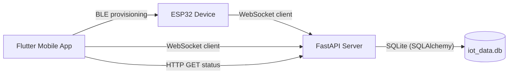

# Code Wiki

This repository contains a small end-to-end IoT demo composed of:
- ESP32 firmware (BLE provisioning + WebSocket control)
- A FastAPI backend (WebSocket router + status HTTP API + SQLite persistence)
- A Flutter mobile app (BLE provisioning UI + WebSocket control UI)

## Contents

- [Repository Layout](#repository-layout)
- [System Architecture](#system-architecture)
- [Module Responsibilities](#module-responsibilities)
- [Cross-Component Protocols](#cross-component-protocols)
- [Backend (FastAPI) Deep Dive](#backend-fastapi-deep-dive)
- [Mobile (Flutter) Deep Dive](#mobile-flutter-deep-dive)
- [Device (ESP32) Deep Dive](#device-esp32-deep-dive)
- [Data Model (SQLite)](#data-model-sqlite)
- [Dependency Relationships](#dependency-relationships)
- [Running the Project](#running-the-project)
- [Troubleshooting](#troubleshooting)

## Repository Layout

```text
/workspace
├─ hardware/
│  └─ smartextension/
│     └─ smartextension.ino          # ESP32 firmware
└─ software/
   ├─ server/
   │  ├─ main.py                     # FastAPI app (HTTP + WebSocket)
   │  ├─ database.py                 # SQLAlchemy engine/session provider
   │  ├─ models.py                   # SQLAlchemy models
   │  └─ requirements.txt            # Python dependencies
   └─ mobile/
      ├─ lib/main.dart               # Flutter entrypoint
      ├─ lib/screens/
      │  ├─ home_screen.dart         # navigation hub
      │  ├─ provision_screen.dart    # BLE provisioning UI/logic
      │  └─ control_screen.dart      # WS control + HTTP status fetch
      └─ pubspec.yaml                # Flutter dependencies
```

## System Architecture

At runtime, the system forms a “hub-and-spoke” topology: the server is the relay between the mobile app and the device.



Key ideas:
- **Provisioning path** (one-time / occasional): Mobile → ESP32 over BLE to set WiFi credentials, server WebSocket URL, and a security PIN.
- **Control path** (runtime): Mobile sends commands via server WebSocket; server forwards to the device WebSocket by `target_id`.
- **State persistence**: Server records device heartbeats and the most recent LED status in SQLite.

## Module Responsibilities

### Hardware: ESP32 firmware

Primary responsibilities:
- Host a BLE “setup” service for provisioning (SSID/PASS/WS URL/PIN).
- Persist settings to ESP32 Preferences storage.
- Connect/reconnect WiFi, then connect/reconnect a WebSocket client to the backend.
- Validate incoming commands with a PIN and control the onboard LED (`LED_PIN=2`).

Entrypoint: [smartextension.ino](file:///workspace/hardware/smartextension/smartextension.ino)

### Software: FastAPI server

Primary responsibilities:
- Accept WebSocket connections from multiple clients (devices and mobile clients).
- Identify each connection by an `id` received in JSON messages.
- Route “command” messages from a sender (mobile) to a target device.
- Persist heartbeats and LED state changes to SQLite.
- Serve an HTTP endpoint for mobile UI to query the latest LED status.

Entrypoint: [main.py](file:///workspace/software/server/main.py)

### Software: Flutter mobile app

Primary responsibilities:
- Provide a BLE provisioning UI to send WiFi credentials, WebSocket URL, and PIN to the ESP32.
- Save WebSocket URL / PIN / device ID locally using shared preferences.
- Provide a WebSocket control UI to send commands to the server.
- Fetch LED status via HTTP to render current state.

Entrypoint: [main.dart](file:///workspace/software/mobile/lib/main.dart)

## Cross-Component Protocols

### BLE provisioning (Mobile → ESP32)

The mobile app scans for an ESP32 advertising as **`MyIoT-Setup`**, connects, discovers a custom service, then writes characteristics:
- Service UUID: `12345678-1234-1234-1234-123456789000`
- SSID UUID: `...9001`
- Password UUID: `...9002`
- PIN UUID: `...9003`
- WebSocket URL UUID: `...9004`

References:
- Flutter constants: [provision_screen.dart](file:///workspace/software/mobile/lib/screens/provision_screen.dart#L8-L12)
- Firmware UUIDs: [smartextension.ino](file:///workspace/hardware/smartextension/smartextension.ino#L32-L39)

Provisioning flow:
1. ESP32 starts advertising when no WiFi SSID exists in storage, or after repeated WiFi failures.
2. Mobile writes SSID, password, WebSocket URL, and PIN.
3. ESP32 validates the PIN logic:
   - If current stored PIN is empty or `0000`, it adopts the provided PIN.
   - Otherwise, the provided PIN must match the stored PIN.
4. ESP32 stores SSID/PASS/WS/PIN in Preferences and stops BLE provisioning.

Reference implementation:
- ESP32 provisioning loop: [startBLEProvisioning](file:///workspace/hardware/smartextension/smartextension.ino#L127-L211)
- Flutter write sequence: [_provisionDevice](file:///workspace/software/mobile/lib/screens/provision_screen.dart#L129-L167)

### WebSocket runtime control (Mobile ⇄ Server ⇄ ESP32)

Both the mobile app and the ESP32 connect to the server WebSocket endpoint:
- Server endpoint: [websocket_endpoint](file:///workspace/software/server/main.py#L94-L183) (`/ws`)

Identification message:
- On first message, the server expects a JSON payload containing an `id`.
- The server uses `id` to register the WebSocket for later routing.

Reference:
- Server identification logic: [ConnectionManager.identify](file:///workspace/software/server/main.py#L13-L47)

Common message shapes:

1) Device online announcement (ESP32 → Server)

```json
{ "id": "esp32-9f83b1c1", "status": "online", "ip": "192.168.1.50" }
```

References:
- ESP32 send on connect: [webSocketEvent](file:///workspace/hardware/smartextension/smartextension.ino#L242-L262)
- Server handling: [main.py](file:///workspace/software/server/main.py#L124-L133)

2) Heartbeat (ESP32 → Server)

```json
{ "id": "esp32-9f83b1c1", "type": "heartbeat", "uptime_ms": 123456 }
```

References:
- ESP32 periodic send: [smartextension.ino](file:///workspace/hardware/smartextension/smartextension.ino#L461-L471)
- Server handling: [main.py](file:///workspace/software/server/main.py#L114-L123)

3) Command (Mobile → Server) and routing (Server → ESP32)

Mobile sends:

```json
{
  "id": "mobile-client-01",
  "target_id": "esp32-9f83b1c1",
  "cmd": "led_on",
  "pin": "0000"
}
```

Server forwards (note: server rewrites the payload to target the device ID):

```json
{ "id": "esp32-9f83b1c1", "cmd": "led_on", "pin": "0000" }
```

References:
- Mobile send: [_sendCommand](file:///workspace/software/mobile/lib/screens/control_screen.dart#L115-L128)
- Server route: [main.py](file:///workspace/software/server/main.py#L134-L155)
- Device receive + enforce PIN: [webSocketEvent](file:///workspace/hardware/smartextension/smartextension.ino#L285-L337)

4) Acknowledgement (ESP32 → Server)

```json
{ "id": "esp32-9f83b1c1", "led": "on", "status": "ok" }
```

Server uses this to persist LED state, which enables the mobile app to fetch the last known state via HTTP.

References:
- ESP32 ack: [smartextension.ino](file:///workspace/hardware/smartextension/smartextension.ino#L303-L327)
- Server persistence: [main.py](file:///workspace/software/server/main.py#L158-L178)

### HTTP status query (Mobile → Server)

Mobile uses HTTP to fetch the last persisted LED status:
- `GET /device/{device_id}/status`

References:
- Server endpoint: [get_device_status](file:///workspace/software/server/main.py#L51-L64)
- Mobile fetch: [_fetchLedStatus](file:///workspace/software/mobile/lib/screens/control_screen.dart#L42-L65)

## Backend (FastAPI) Deep Dive

### Key modules

- [main.py](file:///workspace/software/server/main.py): API surface and WebSocket routing loop.
- [database.py](file:///workspace/software/server/database.py): SQLAlchemy engine + `get_db()` dependency injection.
- [models.py](file:///workspace/software/server/models.py): ORM models `Heartbeat` and `DeviceState`.

### Key classes and functions

#### `ConnectionManager`

File: [main.py](file:///workspace/software/server/main.py#L13-L48)

Responsibilities:
- Track **identified** connections (`active_connections[id] = websocket`).
- Track **unidentified** connections (connected but no `id` message received yet).
- Send a message to a specific connection by ID (`send_personal_message`).

Notes:
- Identification happens opportunistically when the first JSON message with `id` arrives.

#### `websocket_endpoint`

File: [main.py](file:///workspace/software/server/main.py#L94-L183)

Responsibilities:
- Accept WebSocket connections and wait in a receive loop.
- Parse incoming JSON messages and classify them by content:
  - `type == "heartbeat"` → insert a `Heartbeat` row.
  - `status == "online"` → insert a `Heartbeat` row with IP.
  - `"cmd" in json` → route to `target_id` device via `ConnectionManager`.
  - `status == "ok"` and `"led" in json` → upsert `DeviceState`.

#### `get_device_status`

File: [main.py](file:///workspace/software/server/main.py#L51-L64)

Responsibilities:
- Query `DeviceState` by `device_id` and return the last known `led_status`.

#### `get_db`

File: [database.py](file:///workspace/software/server/database.py#L13-L18)

Responsibilities:
- Provide a SQLAlchemy session via FastAPI dependency injection and ensure it is closed.

## Mobile (Flutter) Deep Dive

### Screens and responsibilities

- [HomeScreen](file:///workspace/software/mobile/lib/screens/home_screen.dart#L5-L40): entry navigation between provisioning and control screens.
- [ProvisionScreen](file:///workspace/software/mobile/lib/screens/provision_screen.dart#L14-L238): BLE scan/connect + characteristic writes; stores settings in shared preferences.
- [ControlScreen](file:///workspace/software/mobile/lib/screens/control_screen.dart#L8-L259): WebSocket connect + command sending; HTTP status polling.

### Key functions

#### Provisioning flow

File: [provision_screen.dart](file:///workspace/software/mobile/lib/screens/provision_screen.dart)
- `_checkPermissions()` requests Bluetooth scan/connect and location permissions (Android needs these for BLE scanning).
- `_startScan()` scans for a device whose `platformName` is `MyIoT-Setup`.
- `_connectToDevice()` connects, discovers the custom provisioning service and characteristic UUIDs.
- `_provisionDevice()` writes SSID/PASS/WS URL/PIN, then persists `ws_url`, `device_pin`, and a hard-coded `device_id`.

#### Control flow

File: [control_screen.dart](file:///workspace/software/mobile/lib/screens/control_screen.dart)
- `_loadSettings()` populates UI fields from shared preferences.
- `_connect()` creates a WebSocket connection and sends an initial `{id,status}` online message.
- `_sendCommand(cmd)` sends `{id,target_id,cmd,pin}` commands to the server.
- `_fetchLedStatus()` converts `ws://host:port/ws` to `http://host:port` and requests `GET /device/{device_id}/status`.

## Device (ESP32) Deep Dive

### Key functions

File: [smartextension.ino](file:///workspace/hardware/smartextension/smartextension.ino)
- `loadSettings()` / `saveSettings()` read/write WiFi/WS/PIN from ESP32 Preferences.
- `startBLEProvisioning()` starts a BLE server and blocks in a provisioning loop until all required values are received (or timeout).
- `connectToWiFiOnce()` attempts WiFi connection with a limited retry loop.
- `startWebSocket()` parses `ws_url` into host/port/path and creates a WebSocket connection (SSL for `wss://`).
- `webSocketEvent()` handles connect/disconnect and incoming command JSON; enforces PIN and produces acknowledgements.
- `setup()` boots, enters provisioning if needed, then connects WiFi and starts WebSocket.
- `loop()` watchdogs WiFi, runs `webSocket.loop()`, and sends heartbeat periodically.

### Device identity

The firmware uses a hard-coded ID:
- `DEVICE_ID = "esp32-9f83b1c1"` in [smartextension.ino](file:///workspace/hardware/smartextension/smartextension.ino#L29-L31)

The mobile app default device ID matches this:
- [ProvisionScreen](file:///workspace/software/mobile/lib/screens/provision_screen.dart#L158-L162)
- [ControlScreen](file:///workspace/software/mobile/lib/screens/control_screen.dart#L18-L20)

If you need multiple devices, the firmware and mobile app must be updated to support unique IDs per device.

## Data Model (SQLite)

Database file:
- `iot_data.db` in the server working directory (created at runtime)

Models:
- [Heartbeat](file:///workspace/software/server/models.py#L6-L14)
- [DeviceState](file:///workspace/software/server/models.py#L16-L22)

Tables:
- `heartbeats`
  - `device_id`: ID for ESP32 or other clients (mobile also identifies, but only heartbeats/online are stored)
  - `uptime_ms`: optional
  - `ip_address`: optional
  - `timestamp`: server timestamp
- `device_states`
  - `device_id`: unique device key
  - `led_status`: `"on"|"off"|...`
  - `updated_at`: timestamp (note: current code does not update this field when changing `led_status`)

## Dependency Relationships

### Runtime dependencies (conceptual)

- ESP32 depends on:
  - A WiFi network (SSID/PASS provisioned)
  - A reachable server WebSocket URL (`ws://<server>:<port>/ws`)
  - A matching PIN for command authorization
- Mobile depends on:
  - BLE permissions and proximity to the ESP32 for provisioning
  - Server availability for runtime control (WebSocket + HTTP)
- Server depends on:
  - Python runtime + installed requirements
  - File system write permissions (to create SQLite DB)

### Code dependencies (by package/module)

- Server Python deps: [requirements.txt](file:///workspace/software/server/requirements.txt)
  - `fastapi` + `uvicorn` for serving HTTP/WebSocket
  - `websockets` as WebSocket support
  - `sqlalchemy` for persistence
- Flutter deps: [pubspec.yaml](file:///workspace/software/mobile/pubspec.yaml)
  - `flutter_blue_plus` for BLE
  - `web_socket_channel` for WebSocket client
  - `http` for HTTP calls
  - `shared_preferences` for local settings
  - `permission_handler` for Android runtime permissions
- ESP32 Arduino libs (by include): [smartextension.ino](file:///workspace/hardware/smartextension/smartextension.ino#L15-L22)
  - `WiFi`, `Preferences`, ESP32 BLE (`BLEDevice`, `BLEServer`, …)
  - `WebSocketsClient`
  - `ArduinoJson`

## Running the Project

### 1) Start the backend server

From the server directory:

```bash
cd /workspace/software/server
python -m venv .venv
. .venv/bin/activate
python -m pip install -r requirements.txt
uvicorn main:app --host 0.0.0.0 --port 8000
```

Endpoints:
- WebSocket: `ws://<server-ip>:8000/ws`
- Device status: `http://<server-ip>:8000/device/esp32-9f83b1c1/status`
- Debug DB dump: `http://<server-ip>:8000/db`

### 2) Flash the ESP32 firmware

Prereqs:
- Arduino IDE (or PlatformIO) with ESP32 board support installed
- Libraries: ArduinoJson, WebSocketsClient (and ESP32 BLE support enabled by ESP32 core)

Steps (Arduino IDE):
1. Open [smartextension.ino](file:///workspace/hardware/smartextension/smartextension.ino).
2. Select the correct ESP32 board + serial port.
3. Upload the sketch.

Runtime behavior:
- If no SSID is saved, the device advertises BLE name `MyIoT-Setup`.
- After provisioning, the device connects to WiFi and then to the server WebSocket URL.

### 3) Run the Flutter mobile app

From the mobile directory:

```bash
cd /workspace/software/mobile
flutter pub get
flutter run
```

Usage:
1. Use “Provision Device (BLE)” to configure SSID/PASS, WebSocket URL (e.g. `ws://192.168.1.100:8000/ws`), and PIN.
2. Use “Control Device (WebSocket)” to connect to the server and send LED commands.

## Troubleshooting

- BLE scan does not find `MyIoT-Setup`
  - Confirm the ESP32 is powered and in provisioning mode (no saved SSID or forced provisioning).
  - On Android, ensure Bluetooth and Location are enabled and permissions are granted.
- Mobile connects to WebSocket but commands do nothing
  - Confirm `target_id` matches the device ID (`esp32-9f83b1c1` by default).
  - Confirm the PIN matches the device’s stored PIN.
  - Confirm the device is connected to the server (server logs should show it identified).
- LED status shows as `unknown`
  - The server only updates LED state after receiving an ESP32 `{"status":"ok","led":"..."}` acknowledgement.
  - Trigger a command (LED ON/OFF) to cause an acknowledgement and persistence.
