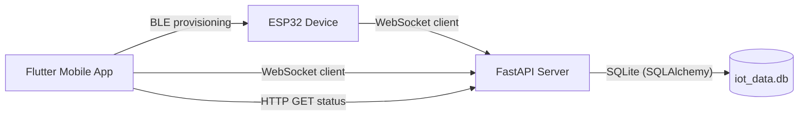
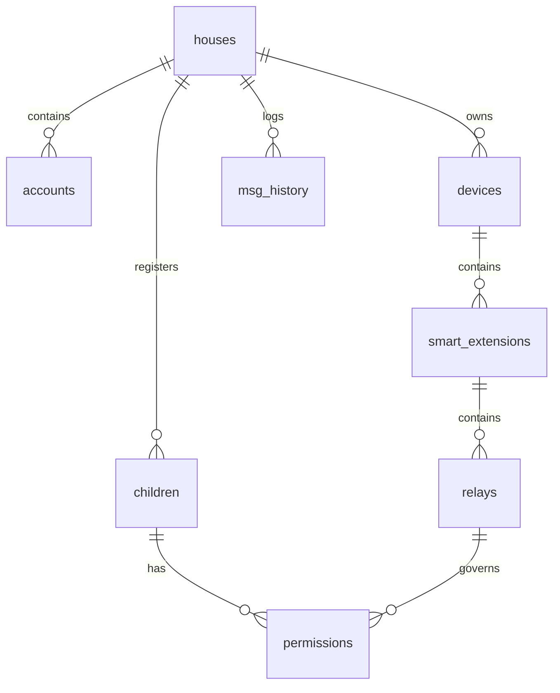

# Code Wiki

This repository contains a small end-to-end IoT demo composed of:
- ESP32 firmware (BLE provisioning + WebSocket control)
- A FastAPI backend (WebSocket router + status HTTP API + SQLite persistence)
- A Flutter mobile app (BLE provisioning UI + WebSocket control UI)

## Contents

- [Repository Layout](#repository-layout)
- [System Architecture](#system-architecture)
- [Module Responsibilities](#module-responsibilities)
- [Cross-Component Protocols](#cross-component-protocols)
- [Backend (FastAPI) Deep Dive](#backend-fastapi-deep-dive)
- [Mobile (Flutter) Deep Dive](#mobile-flutter-deep-dive)
- [Device (ESP32) Deep Dive](#device-esp32-deep-dive)
- [Data Model (SQLite)](#data-model-sqlite)
- [Dependency Relationships](#dependency-relationships)
- [Running the Project](#running-the-project)
- [Troubleshooting](#troubleshooting)

## Repository Layout

```text
/workspace
├─ hardware/
│  └─ smartextension/
│     └─ smartextension.ino          # ESP32 firmware
└─ software/
   ├─ server/
   │  ├─ main.py                     # FastAPI app (HTTP + WebSocket)
   │  ├─ database.py                 # SQLAlchemy engine/session provider
   │  ├─ models.py                   # SQLAlchemy models
   │  └─ requirements.txt            # Python dependencies
   └─ mobile/
      ├─ lib/main.dart               # Flutter entrypoint
      ├─ lib/screens/
      │  ├─ home_screen.dart         # navigation hub
      │  ├─ provision_screen.dart    # BLE provisioning UI/logic
      │  └─ control_screen.dart      # WS control + HTTP status fetch
      └─ pubspec.yaml                # Flutter dependencies
```

## System Architecture

At runtime, the system forms a “hub-and-spoke” topology: the server is the relay between the mobile app and the device.



Key ideas:
- **Provisioning path** (one-time / occasional): Mobile → ESP32 over BLE to set WiFi credentials, server WebSocket URL, and a security PIN.
- **Control path** (runtime): Mobile sends commands via server WebSocket; server forwards to the device WebSocket by `target_id`.
- **State persistence**: Server records device heartbeats, channel relay states, accounts, children profiles, and permissions in SQLite.

## Module Responsibilities

### Hardware: ESP32 firmware

Primary responsibilities:
- Host a BLE “setup” service for provisioning (SSID/PASS/WS URL/PIN).
- Persist settings to ESP32 Preferences storage.
- Connect/reconnect WiFi, then connect/reconnect a WebSocket client to the backend.
- Validate incoming commands with a PIN and control 3 output channels (GPIO 2, 4, 5).

Entrypoint: [smartextension.ino](file:///c:/dev/fyp/Maya-Smarthome-AI/hardware/smartextension/smartextension.ino)

### Software: FastAPI server

Primary responsibilities:
- Accept WebSocket connections from multiple clients (devices and mobile clients).
- Identify each connection by an `id` received in JSON messages.
- Route “command” messages from a sender (mobile) to a target device.
- Persist heartbeats, message history, user accounts, and relay state changes to SQLite.
- Serve HTTP endpoints for mobile and web clients to authenticate, log in, register devices, and query status.

Entrypoint: [main.py](file:///c:/dev/fyp/Maya-Smarthome-AI/software/server/main.py)

### Software: Flutter mobile app

Primary responsibilities:
- Provide a BLE provisioning UI to send WiFi credentials, WebSocket URL, and PIN to the ESP32.
- Save WebSocket URL / PIN / device ID locally using shared preferences.
- Provide a WebSocket control UI to send commands to the server.
- Fetch device status via HTTP or WebSocket to render current state.

Entrypoint: [main.dart](file:///c:/dev/fyp/Maya-Smarthome-AI/software/mobile/lib/main.dart)

## Cross-Component Protocols

### BLE provisioning (Mobile → ESP32)

The mobile app scans for an ESP32 advertising as **`Maya-Setup`**, connects, discovers a custom service, then writes characteristics:
- Service UUID: `12345678-1234-1234-1234-123456789000`
- SSID UUID: `...9001`
- Password UUID: `...9002`
- PIN UUID: `...9003`
- WebSocket URL UUID: `...9004`

References:
- Flutter constants: [provision_screen.dart](file:///c:/dev/fyp/Maya-Smarthome-AI/software/mobile/lib/screens/provision_screen.dart#L9-L13)
- Firmware UUIDs: [smartextension.ino](file:///c:/dev/fyp/Maya-Smarthome-AI/hardware/smartextension/smartextension.ino#L56-L61)

Provisioning flow:
1. ESP32 starts advertising when no WiFi SSID exists in storage, or after repeated WiFi failures.
2. Mobile writes SSID, password, WebSocket URL, and PIN.
3. ESP32 validates the PIN logic:
   - If current stored PIN is empty or `0000`, it adopts the provided PIN.
   - Otherwise, the provided PIN must match the stored PIN.
4. ESP32 stores SSID/PASS/WS/PIN in Preferences and stops BLE provisioning.

Reference implementation:
- ESP32 provisioning loop: [startBLEProvisioning](file:///c:/dev/fyp/Maya-Smarthome-AI/hardware/smartextension/smartextension.ino#L135-L199)
- Flutter write sequence: [_provisionDevice](file:///c:/dev/fyp/Maya-Smarthome-AI/software/mobile/lib/screens/provision_screen.dart#L135-L193)

### WebSocket runtime control (Mobile ⇄ Server ⇄ ESP32)

Both the mobile app and the ESP32 connect to the server WebSocket endpoint:
- Server endpoint: [websocket_endpoint](file:///c:/dev/fyp/Maya-Smarthome-AI/software/server/main.py#L814-L821) (`/ws` or `/`)

Identification message:
- On first message, the server expects a JSON payload containing an `id`.
- The server uses `id` to register the WebSocket for later routing.

Reference:
- Server identification logic: [ConnectionManager.identify](file:///c:/dev/fyp/Maya-Smarthome-AI/software/server/main.py#L50-L55)

Common message shapes:

1) Device online announcement (ESP32 → Server)

```json
{ "id": "esp32-9f83b1c1", "status": "online", "ip": "192.168.1.50", "ch1": "off", "ch2": "off", "ch3": "off" }
```

References:
- ESP32 send on connect: [webSocketEvent](file:///c:/dev/fyp/Maya-Smarthome-AI/hardware/smartextension/smartextension.ino#L266-L282)
- Server handling: [main.py](file:///c:/dev/fyp/Maya-Smarthome-AI/software/server/main.py#L736-L761)

2) Heartbeat (ESP32 → Server)

```json
{ "id": "esp32-9f83b1c1", "type": "heartbeat", "uptime_ms": 123456, "ch1": "off", "ch2": "off", "ch3": "off" }
```

References:
- ESP32 periodic send: [smartextension.ino](file:///c:/dev/fyp/Maya-Smarthome-AI/hardware/smartextension/smartextension.ino#L475-L488)
- Server handling: [main.py](file:///c:/dev/fyp/Maya-Smarthome-AI/software/server/main.py#L716-L734)

3) Command (Mobile → Server) and routing (Server → ESP32)

Mobile sends command payload via WebSocket or HTTP `/api/devices/{device_id}/command`.
For WebSocket forwarding, the server routes the message:

```json
{ "id": "esp32-9f83b1c1", "cmd": "output_on", "channel": 1, "pin": "0000" }
```

References:
- Mobile send command over WS: [_sendCommand](file:///c:/dev/fyp/Maya-Smarthome-AI/software/mobile/lib/screens/control_screen.dart#L123-L139)
- Server WebSocket command route: [main.py](file:///c:/dev/fyp/Maya-Smarthome-AI/software/server/main.py#L762-L777)
- Device receive + enforce PIN: [webSocketEvent](file:///c:/dev/fyp/Maya-Smarthome-AI/hardware/smartextension/smartextension.ino#L284-L370)

4) Acknowledgement (ESP32 → Server)

```json
{ "id": "esp32-9f83b1c1", "status": "ok", "ch1": "on", "ch2": "off", "ch3": "off" }
```

Server uses this to persist relay states and update database.

References:
- ESP32 ack: [smartextension.ino](file:///c:/dev/fyp/Maya-Smarthome-AI/hardware/smartextension/smartextension.ino#L245-L255)
- Server updates: [main.py](file:///c:/dev/fyp/Maya-Smarthome-AI/software/server/main.py#L778-L800)

### HTTP status query (Mobile → Server)

Mobile uses HTTP to fetch the last persisted relay statuses:
- `GET /device/{device_id}/status` (Legacy) or `/api/devices/{device_id}`

References:
- Server legacy endpoint: [get_device_status_legacy](file:///c:/dev/fyp/Maya-Smarthome-AI/software/server/main.py#L656-L669)
- Mobile fetch: [_fetchChannelStates](file:///c:/dev/fyp/Maya-Smarthome-AI/software/mobile/lib/screens/control_screen.dart#L52-L69)

---

## Backend (FastAPI) Deep Dive

### Key modules

- [main.py](file:///c:/dev/fyp/Maya-Smarthome-AI/software/server/main.py): API endpoints, WebSocket connection and message router loop.
- [database.py](file:///c:/dev/fyp/Maya-Smarthome-AI/software/server/database.py): SQLite database configuration and session helpers.
- [models.py](file:///c:/dev/fyp/Maya-Smarthome-AI/software/server/models.py): Object Relational Mapping (ORM) models for all 9 database tables.
- [auth.py](file:///c:/dev/fyp/Maya-Smarthome-AI/software/server/auth.py): JWT token utility functions and dependency injections for authenticating user and child roles.

### Key classes and functions

#### `ConnectionManager`

File: [main.py](file:///c:/dev/fyp/Maya-Smarthome-AI/software/server/main.py#L24-L78)

Responsibilities:
- Track active and unidentified WebSocket connections.
- Keep in-memory device metadata (e.g. status, IP address, uptime).
- Support bidirectional synchronization, waiting for command execution acknowledgements (`wait_for_ack`, `resolve_ack`).

#### `_handle_websocket`

File: [main.py](file:///c:/dev/fyp/Maya-Smarthome-AI/software/server/main.py#L697-L813)

Responsibilities:
- Manage the main WebSocket event router loop.
- Process `"heartbeat"`, `"status" == "online"`, and ack `"status" == "ok"` messages.
- Updates device state configurations (`Device` and `Relay` fields) in SQLite and appends logs to `Heartbeat`.

---

## Mobile (Flutter) Deep Dive

### Screens and responsibilities

- [HomeScreen](file:///c:/dev/fyp/Maya-Smarthome-AI/software/mobile/lib/screens/home_screen.dart): Landing panel for navigating between BLE setup, authentication, and output controls.
- [ProvisionScreen](file:///c:/dev/fyp/Maya-Smarthome-AI/software/mobile/lib/screens/provision_screen.dart): Discovers and binds WiFi/WebSocket credentials over BLE to the device.
- [ControlScreen](file:///c:/dev/fyp/Maya-Smarthome-AI/software/mobile/lib/screens/control_screen.dart): Provides controls for toggling outputs (CH1, CH2, CH3) over WebSockets and polls status.
- [AuthScreen](file:///c:/dev/fyp/Maya-Smarthome-AI/software/mobile/lib/screens/auth_screen.dart): Authenticates or registers parent and home details on the server.

---

## Device (ESP32) Deep Dive

### Key functions

File: [smartextension.ino](file:///c:/dev/fyp/Maya-Smarthome-AI/hardware/smartextension/smartextension.ino)
- `setup()` initializes output pins (GPIO 2, 4, and 5) and starts connectivity modules.
- `startBLEProvisioning()` boots BLE server to advertise characteristics.
- `webSocketEvent()` handles incoming JSON commands (`output_on`, `output_off`, `output_toggle`, `all_on`, `all_off`) and validates security credentials (PIN).
- `loop()` ensures connection survival and emits heartbeats every 30 seconds.

---

## Data Model (SQLite)

Database file:
- `iot_data.db` (created in the server directory at runtime)

The system defines 9 interdependent tables representing households, accounts, devices, child logins, permissions, logs, and messaging history.

### Database Schema Details & Field Map



1. **`accounts`** (`Account` model):
   * `acc_id` (Primary Key)
   * `house_id` (Foreign Key referencing `houses.house_id`)
   * `email` (Unique login email)
   * `password` (Hashed password string)
   * `name` (User display name)
   * `role` (Enum: `parent`, `admin`, `child`)
   * `is_master` / `is_home` (Boolean flags)
   * `created_at` (Timestamp)

2. **`houses`** (`House` model):
   * `house_id` (Primary Key)
   * `location` (String physical location details)
   * `created_at` (Timestamp)

3. **`children`** (`Child` model):
   * `child_id` (Primary Key)
   * `house_id` (Foreign Key referencing `houses.house_id`)
   * `name` (Child display name)
   * `pin` (Hashed PIN for login validation)
   * `is_home` (Boolean location state)
   * `created_at` (Timestamp)

4. **`devices`** (`Device` model):
   * `device_id` (Primary Key string, e.g., `esp32-9f83b1c1`)
   * `house_id` (Foreign Key referencing `houses.house_id`)
   * `name` (Custom extension name)
   * `status` (Offline/Online/Registered text state)
   * `price` (Price variable)
   * `blocked` (Boolean lockout flag managed by admins)
   * `created_at` (Timestamp)

5. **`smart_extensions`** (`SmartExtension` model):
   * `se_id` (Primary Key)
   * `device_id` (Foreign Key referencing `devices.device_id`)
   * `name` (Name string)
   * `created_at` (Timestamp)

6. **`relays`** (`Relay` model):
   * `relay_id` (Primary Key)
   * `se_id` (Foreign Key referencing `smart_extensions.se_id`)
   * `name` (Name string)
   * `channel_number` (Integer identifier: 1, 2, or 3)
   * `is_on` (Boolean relay activation state)
   * *Constraint:* Unique combo of `se_id` + `channel_number`

7. **`permissions`** (`Permission` model):
   * `permission_id` (Primary Key)
   * `child_id` (Foreign Key referencing `children.child_id`)
   * `relay_id` (Foreign Key referencing `relays.relay_id`)
   * `is_allowed` (Boolean authorization flag)
   * *Constraint:* Unique combo of `child_id` + `relay_id`

8. **`msg_history`** (`MsgHistory` model):
   * `msg_id` (Primary Key)
   * `house_id` (Foreign Key referencing `houses.house_id`)
   * `sender_id` (ID of the account or child profile)
   * `sender_type` (Sender type tag)
   * `message` (Log / message body text)
   * `timestamp` (Timestamp)

9. **`heartbeats`** (`Heartbeat` model):
   * `id` (Primary Key)
   * `device_id` (Device identifier)
   * `uptime_ms` (Current uptime duration)
   * `ip_address` (Network IP string)
   * `ch1`, `ch2`, `ch3` (Output channel states: `"on"` or `"off"`)
   * `timestamp` (Timestamp)

---

## Dependency Relationships

### Runtime dependencies (conceptual)

- ESP32 depends on:
  - A WiFi network (SSID/PASS provisioned)
  - A reachable server WebSocket URL (`ws://<server>:<port>/ws`)
  - A matching PIN for command authorization
- Mobile depends on:
  - BLE permissions and proximity to the ESP32 for provisioning
  - Server availability for runtime control (WebSocket + HTTP)
- Server depends on:
  - Python runtime + installed requirements
  - File system write permissions (to create SQLite DB)

### Code dependencies (by package/module)

- Server Python deps: [requirements.txt](file:///c:/dev/fyp/Maya-Smarthome-AI/software/server/requirements.txt)
  - `fastapi` + `uvicorn` for serving HTTP/WebSocket
  - `websockets` as WebSocket support
  - `sqlalchemy` for persistence
- Flutter deps: [pubspec.yaml](file:///c:/dev/fyp/Maya-Smarthome-AI/software/mobile/pubspec.yaml)
  - `flutter_blue_plus` for BLE
  - `web_socket_channel` for WebSocket client
  - `http` for HTTP calls
  - `shared_preferences` for local settings
  - `permission_handler` for Android runtime permissions
- ESP32 Arduino libs (by include): [smartextension.ino](file:///c:/dev/fyp/Maya-Smarthome-AI/hardware/smartextension/smartextension.ino#L18-L25)
  - `WiFi`, `Preferences`, ESP32 BLE (`BLEDevice`, `BLEServer`, …)
  - `WebSocketsClient`
  - `ArduinoJson`

## Running the Project

### 1) Start the backend server

From the server directory:

```bash
cd /workspace/software/server
python -m venv .venv
. .venv/bin/activate
python -m pip install -r requirements.txt
uvicorn main:app --host 0.0.0.0 --port 8000
```

Endpoints:
- WebSocket: `ws://<server-ip>:8000/ws`
- Device status: `http://<server-ip>:8000/api/devices/esp32-9f83b1c1`
- Admin dashboard: `http://<server-ip>:8000/admin`
- Debug DB dump: `http://<server-ip>:8000/db`

### 2) Flash the ESP32 firmware

Prereqs:
- Arduino IDE (or PlatformIO) with ESP32 board support installed
- Libraries: ArduinoJson, WebSocketsClient (and ESP32 BLE support enabled by ESP32 core)

Steps (Arduino IDE):
1. Open [smartextension.ino](file:///c:/dev/fyp/Maya-Smarthome-AI/hardware/smartextension/smartextension.ino).
2. Select the correct ESP32 board + serial port.
3. Upload the sketch.

Runtime behavior:
- If no SSID is saved, the device advertises BLE name `Maya-Setup`.
- After provisioning, the device connects to WiFi and then to the server WebSocket URL.

### 3) Run the Flutter mobile app

From the mobile directory:

```bash
cd /workspace/software/mobile
flutter pub get
flutter run
```

Usage:
1. Use “Provision Device (BLE)” to configure SSID/PASS, WebSocket URL (e.g. `ws://192.168.1.100:8000/ws`), and PIN.
2. Use “Control Device (WebSocket)” to connect to the server and send commands.

## Troubleshooting

- BLE scan does not find `Maya-Setup`
  - Confirm the ESP32 is powered and in provisioning mode (no saved SSID or forced provisioning).
  - On Android, ensure Bluetooth and Location are enabled and permissions are granted.
- Mobile connects to WebSocket but commands do nothing
  - Confirm `target_id` matches the device ID (`esp32-9f83b1c1` by default).
  - Confirm the PIN matches the device’s stored PIN.
  - Confirm the device is connected to the server (server logs should show it identified).
- LED status shows as `unknown`
  - The server only updates LED state after receiving an ESP32 `{"status":"ok","led":"..."}` acknowledgement.
  - Trigger a command (turn channel ON/OFF) to cause an acknowledgement and persistence.
